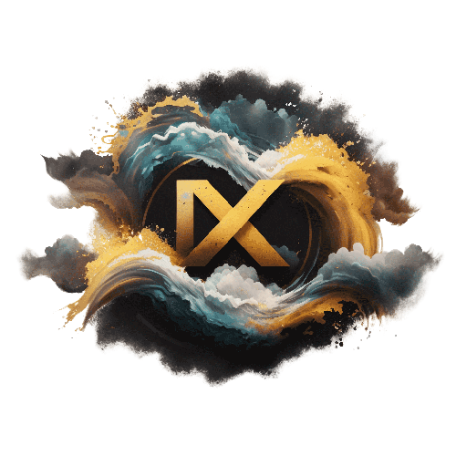

<!-- Template for readme used: https://github.com/othneildrew/Best-README-Template -->

<!-- PROJECT SHIELDS -->
<!--
*** I'm using markdown "reference style" links for readability.
*** Reference links are enclosed in brackets [ ] instead of parentheses ( ).
*** See the bottom of this document for the declaration of the reference variables
*** for contributors-url, forks-url, etc. This is an optional, concise syntax you may use.
*** https://www.markdownguide.org/basic-syntax/#reference-style-links
-->
[![Contributors][contributors-shield]][contributors-url]
[![Forks][forks-shield]][forks-url]
[![Stargazers][stars-shield]][stars-url]
[![Issues][issues-shield]][issues-url]
[![MIT License][license-shield]][license-url]

<!-- PROJECT LOGO -->
 

<h3 align="center">NxTLobby</h3>

  

  

    Your next lobby system
     
    <a href="https://github.com/orgs/NxTCrew/NxTLobby/wiki"><strong>Explore the docs »</strong></a>
     
     
    <a href="https://github.com/orgs/NxTCrew/NxTLobby/issues">Report Bug</a>
    ·
    <a href="https://github.com/orgs/NxTCrew/NxTLobby/issues">Request Feature</a>
  

<!-- ABOUT THE PROJECT -->
## About The Project

NxT is a entire ecosystem of plugins for Minecraft servers. This is the lobby plugin of the ecosystem.

(<a href="#readme-top">back to top</a>)

### Built With

* [![Kotlin][Kotlin]][Kotlin-url]
* [![Spigot][Spigot]][Spigot-url]
* [![Gradle][Gradle]][Gradle-url]

(<a href="#readme-top">back to top</a>)

<!-- GETTING STARTED -->
## Getting Started

To get a local copy up and running follow these simple steps.

### Prerequisites

You need the following software to run this plugin:
* Minecraft Spigot-based server software 1.19+ (Paper recommended)
* Java 17

### Installation

1. Download the latest [release](releases)
2. Upload the plugin to your server
3. Start your server and enjoy!
4. Configure the plugin to your liking in the `plugins/NxTLobby/config.yml` file

(<a href="#readme-top">back to top</a>)

<!-- ROADMAP -->
## Roadmap

- [ ] Extension system
  - [ ] Dynamic loading of extensions
  - [ ] Extension API
  - [ ] Extension examples
  - [ ] Extension documentation
  - [ ] Extension cloud
- [ ] Language system
  - [ ] Dynamic loading of languages
  - [ ] Language API
- [ ] Command system
  - [ ] Dynamic loading of commands
  - [ ] Command API
- [ ] Event system
  - [ ] Dynamic loading of events
  - [ ] Event API
- [ ] GUI system
    - [ ] GUI API
    - [ ] GUI examples
    - [ ] GUI documentation
- [ ] Database system
- [ ] API
- [ ] Documentation

See the [open issues](issues) for a full list of proposed features (and known issues).

(<a href="#readme-top">back to top</a>)

<!-- CONTRIBUTING -->
## Contributing

Contributions are what make the open source community such an amazing place to learn, inspire, and create. Any contributions you make are **greatly appreciated**.

If you have a suggestion that would make this better, please fork the repo and create a pull request. You can also simply open an issue with the tag "enhancement".
Don't forget to give the project a star! Thanks again!

1. Fork the Project
2. Create your Feature Branch (`git checkout -b feature/AmazingFeature`)
3. Commit your Changes (`git commit -m 'Add some AmazingFeature'`)
4. Push to the Branch (`git push origin feature/AmazingFeature`)
5. Open a Pull Request

(<a href="#readme-top">back to top</a>)

<!-- LICENSE -->
## License

Distributed under the MIT License. See `LICENSE` for more information.

(<a href="#readme-top">back to top</a>)

<!-- CONTACT -->
## Contact

Project Link: [https://github.com/orgs/NxTCrew/NxTLobby](https://github.com/orgs/NxTCrew/NxTLobby)

(<a href="#readme-top">back to top</a>)

<!-- ACKNOWLEDGMENTS -->
## Acknowledgments

* [GitHub Emoji Cheat Sheet](https://www.webpagefx.com/tools/emoji-cheat-sheet)
* [Img Shields](https://shields.io)
* [GitHub Pages](https://pages.github.com)

(<a href="#readme-top">back to top</a>)

<!-- MARKDOWN LINKS & IMAGES -->
<!-- https://www.markdownguide.org/basic-syntax/#reference-style-links -->
[contributors-shield]: https://img.shields.io/github/contributors/NxTCrew/NxTLobby.svg?style=for-the-badge
[contributors-url]: https://github.com/orgs/NxTCrew/NxTLobby/graphs/contributors
[forks-shield]: https://img.shields.io/github/forks/NxTCrew/NxTLobby.svg?style=for-the-badge
[forks-url]: https://github.com/NxTCrew/NxTLobby/network/members
[stars-shield]: https://img.shields.io/github/stars/NxTCrew/NxTLobby.svg?style=for-the-badge
[stars-url]: https://github.com/NxTCrew/NxTLobby/stargazers
[issues-shield]: https://img.shields.io/github/issues/NxTCrew/NxTLobby.svg?style=for-the-badge
[issues-url]: https://github.com/NxTCrew/NxTLobby/issues
[license-shield]: https://img.shields.io/github/license/NxTCrew/NxTLobby.svg?style=for-the-badge
[license-url]: https://github.com/orgs/NxTCrew/NxTLobby/main/LICENSE

[Spigot]: https://img.shields.io/badge/Spigot-1.19+-green.svg?style=for-the-badge
[Spigot-url]: https://www.spigotmc.org/
[Kotlin]: https://img.shields.io/badge/Kotlin-1.8.0-blue.svg?style=for-the-badge
[Kotlin-url]: https://kotlinlang.org/
[Gradle]: https://img.shields.io/badge/Gradle-7.4.2-blue.svg?style=for-the-badge
[Gradle-url]: https://gradle.org/